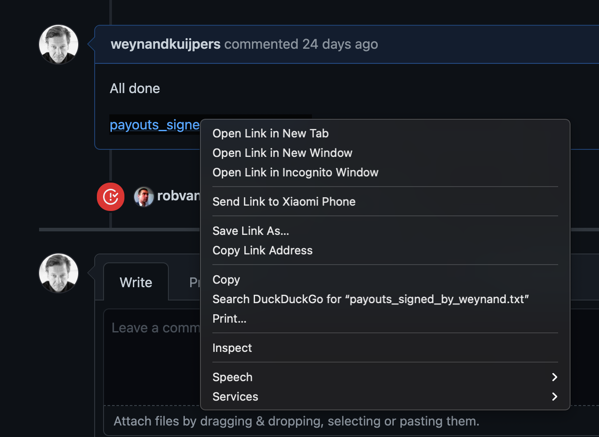

## Install the signing software

To install a fresh copy of the singing software to partake and complete the multi signature process at the end of the month to create and sign the farmed TFT's to farmers, you need to have 2 things to start the installation
- A cosign private key  
- Installed docker on you operating system of choice.

For help with installing the Docker software suite on your operating system of choice, please refer to the docker documentation [here](https://www.docker.com/products/docker-desktop)

Per operating system:
- for Macos: https://hub.docker.com/editions/community/docker-ce-desktop-mac
- for Windows: https://hub.docker.com/editions/community/docker-ce-desktop-windows
- for linux:  see you distribution to find how to install docker.

Once installed you should be able to do the following test in a terminal / command shell and get the (long) output of the docker command.
```
johndoe@Johns-MacBook-Pro-6 github % docker
```
This should give you a lot of outout describing what options are available for the `docker` command.

## 1. download and store the docker ubuntu image

To download and store the docker ubuntu image:
```
docker run -ti ubuntu
```

Output should look like:
```
Unable to find image 'ubuntu:latest' locally
latest: Pulling from library/ubuntu
Digest: sha256:adf73ca014822ad8237623d388cedf4d5346aa72c270c5acc01431cc93e18e2d
Status: Downloaded newer image for ubuntu:latest
root@a6c169a3ac2f:/#
```
And if you look carefully, the command prompt changed to `root@a6c169a3ac2f:/#` which means you are no inside the running ubuntu container.

To do the following needed steps, it's easiest to copy & paste the following steps into the ubuntu container.  copy paste them one by one and press `enter`

```apt update```

```apt upgrade -y```

```apt-get install -y git python3-venv python3-pip redis-server tmux nginx wget -y```

```pip3 install poetry```

```python3 -m pip install js-sdk```

Copy paste all the lines above into the ubuntu container and press `enter`. This will take a while and a lot of output will be generated to your screen.  Have a coffee and wait it out.  When this is done - repeat with all the lines in the block below:
```
cd
mkdir code
cd code
mkdir github
cd github
mkdir threefoldtech
cd threefoldtech
wget https://github.com/threefoldtech/js-sdk/tarball/master ; tar xvf ./master ; rm master
cd three*
poetry update
poetry install
poetry shell
```
It will produce again a lot of output - another coffee or do some work.

The end result is all updates software, and in the ubuntu container you now have a fully configures poetry shell which is what you need to start `jsng`.

So type ```jsng``` and see something like this:
```
root@51b1e37e5510:~/code/github/threefoldtech/threefoldtech-js-sdk-e44e950# jsng
JS-NG>


 [F4] Emacs  1/1 [F3] History [F6] Paste mode                                                                                                                  [F2] Menu - CPython 3.8.5
 ```

Now we're ready to rock. Last item is to install you private key.  To do so - we need type in two command in the `jsng` shell.

First one:
```
j.clients.stellar.new('TFCosigningwallet', secret='<<insert your private key - starting with a capital S>>')
```
Response should look like:
```
Stellar(
  instance_name='TFCosigningwallet',
  network=<Network.STD: 'STD'>,
  address='<<your stella signing wallet address>>',
  secret='<<your private key>>'
)

JS-NG>
```
Success!  you now just need to save the private in in the `jsng` environment.  This is one more command:
```
j.clients.stellar.TFCosigningwallet.save()
```
All done, you can now exit.
```
exit()
```

To get the signing script please do this:
```
wget  https://raw.githubusercontent.com/threefoldfoundation/tft-stellar/development_install_minting/docs/install_signing/sign.py
chmod 755 ./sign.py
```

And to get the previous signers output please go to the issue and copy the link to the file of the previous signer: 

With that link, comlpete the following command in the ubuntu container:
```
wget <<insert copied link>>
```
you should now have that file in the base directory of the `js-sdk` repo.   To sign all we need to do is:
```
./sign.py <<name_of_downloaded_file_from_previous_signer.txt>> <<my_name_outputfile.txt>>
```

A process should start (and take a couple of hours to complete) that looks like this:
```
JS-NG> exit()
root@acc50e7f1bda:~/code/github/threefoldtech/threefoldtech-js-sdk-e44e950# ./sign.py payouts_signed_by_ahmed.txt new_out.txt
Signing 1386.1497888 TFT:GBOVQKJYHXRR3DX6NOX2RRYFRCUMSADGDESTDNBDS6CDVLGVESRTAC47 to <MuxedAccount [account_id=GAMT37U3JASMVGI5GR4TD7HV7ECOUUY7I4A7NZPOVNJKBY27ET7NQFQ2, account_id_id=None]> with memo 000cd192858680a001f70cdbbadde487322a58bfc27804afc050e13e272f9336 and sequence number 121828310719140709
Signing 9656.2832274 
.......
```


