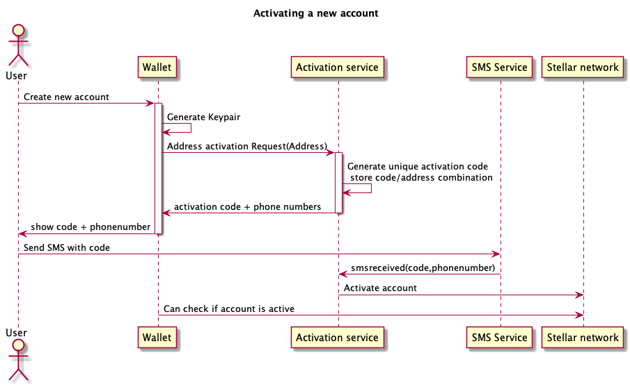

# Address activation

A stated in the [documentation](../docs/address_activation.md):

Stellar addresses need to be activated and a minimal amount of XLM (2.6) has to be kept on the account to be activewith a trustline.

To minimize the burdon for TFT holders, the threefoldfoundation will activate accounts for their users.

All very cool but the risk is real that others will abuse this service to activate non TFT related accounts or steal XLM from the foundation by repeatedly having accounts activated after which the Lumens are transferred away.

## During conversion

This is already implemented and described in the [documentation](../docs/address_activation.md).

## New accounts

If users download the wallet app, how do we bootstrap them without opening a way for hackers to drain the foundations XLM?

A proposal is to have them send an SMS with a code generated in the wallet. This has several benefits:

- Normally it costs a very small amount of money to send an SMS, making a hack not worth it, even if you have an amount of free SMS's.
- If needed we can limit the number of activations per phone number
- Is easy to automate

Even though 99.9% of the users will use the Threefold app on their phone, a few users may use a tablet or other device not capable of sending an SMS. This is why a code is generated that can be easily typed in an SMS instead of sending the full stellar address.

