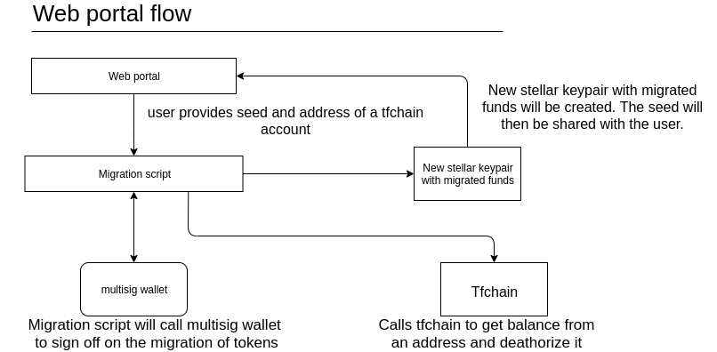
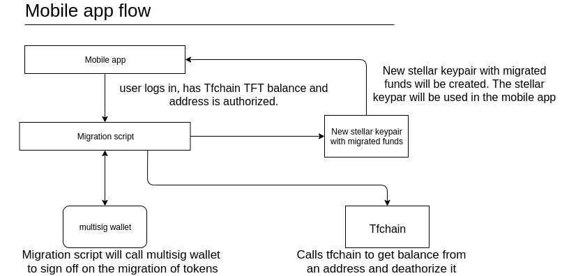

# Conversion of TFT from tfchain to the stellar platform

[Rivine addresses can not be converted to Stellar addresses without knowing the private key](https://github.com/threefoldtech/rivine/blob/master/research/stellar/examples/accounts/readme.md#rivine-key-conversion).

The other way is possible though but it does mean that a script to transfer all funds from tfchain to the Stellar platform is not possible.

## Automated script

To migrate funds from Tfchain to Stellar an automated script should be created which will hold and distribute all the Stellar tokens (TFT-Stellar).
If the script needs to be activated it should be signed by a multisignature wallet.

The script should atleast do following:
* Get the balance of an address on the Tfchain blockchain.
* Be able to create Stellar keypairs.
* Credit Stellar TFT's 1:1 for Tfchain TFT's (locked and unlocked tokens).
* Deauthorize (lock) the Tfchain address.

## Proposed swap methods

### Web swap 

### Mobile swap 

 