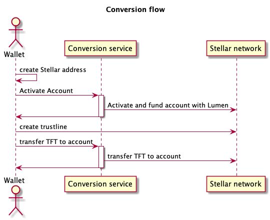

# Conversion of TFT from tfchain to the stellar platform

While new users can be placed on the Stellar platform directly, existing ones need to have their funds migrated.

[Rivine addresses can not be converted to Stellar addresses without knowing the private key](https://github.com/threefoldtech/rivine/blob/master/research/stellar/examples/accounts/readme.md#rivine-key-conversion).
The other way is possible though but it does mean that a script to transfer all funds from tfchain to the Stellar platform is not possible.

A possible solution is to provide a service to migrate the funds on demand, activated by the user's wallet and make sure the private key never leaves the user wallet.

Before the conversion, all addresses on tfchain will be locked by unauthorizing them. [A separate document explains why and the details](./locked_conversion_transaction.md).

## Process

- at conversion time, ALL the Rivine blockchain accounts get locked, this means no-one can transact on Rivine any longer.
- only the user knows the private key so its impossible for any script to transfer the money from Rivine to Stellar.
- at time of the users convenience a user logs into the ThreeFold Wallet (3bot connect) and the following process happens
    - the wallet creates an account on Stellar with same private key (which is only visible by the user !!!)
    - the stellar account creation can only happen by the wallet on the phone for security purposes and is 100% decentralized.
    - a [Locked Conversion Transaction](./locked_conversion_transaction.md) is started to allow the funds to switch blockchain.
    - the TFTA is created on Stellar and send to the users stellar account, the rivine lock transaction hash is attached to this stellar transaction to make sure there is 100% transparancy while the switch happens.

## Flow

