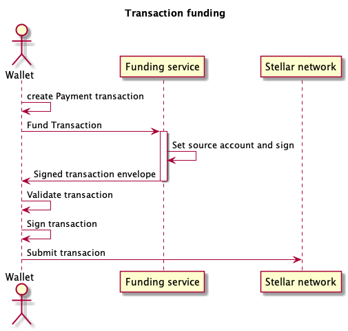

# Funding TFT transactions

## Problem

Transaction fees for TFT on the Stellar platform should be paid in Lumen (XLM) and not in TFT.
It is uncomfortable for users to require and purchase Lumen to be able to do TFT transactions.

## Solution

A solution is to fund the transactions from the Threefoldfoundation since transaction fees are very low.

## Stellar signatures

In Stellar, there is the notion of a transaction and a transaction envelope. The transaction contains all information and the transaction envelope contains the transaction + the required signatures.

Signatures are made over hash(network id, transaction envelope type identifier,serialized transaction).

This means that signatures can only be added if the complete transaction is already constructed.

## External Funding flow

Given the way how signatures work, the transaction needs to be complete before anything can be signed. As a consequence, the client needs to know the funding service's details, even with the sequence number which might cause problems.

It's easier is to have the funding service fill in the source account,sign the transaction envelope and give it back to the client. The client needs to verify if everything is still correct( nothing else has been tempered with), sign and publish it.

## Extensions

### Pay fee in TFT

It is possible to add a fee in TFT for the funding service to accept the transaction to fund or it can be added by the funding service and then it's up to the client to accept it.

This way transaction fees could stay the same as in the curren tfchain implementation.
