# Unvesting

## Price determination

The price for a month is determined using [stellar.expert](https://stellar.expert) data.
A [script](../../scrips/info/stellarexpert/tftprice.py) to determine the weighted average price for a month is available so everyone can check.

## Ckecking vesting accounts

Even though everyone can check for vesting accounts on the Stellar network and calculate the free and vested amounts themselves, a service is available to make this process easier: the `vesting_accounts` endpoint on the [vesting service](../../ThreeBotPackages/vesting_service/readme.md).

It returns the vesting accounts for an owner addresss and for each vesting account the total, free and vested tft balances.

## unvesting initiation

The client knows the vesting account address and the free balance.

The unvesting is initiated by the client. A transaction is constructed that transfers an amount equal to or less than the free amount to another address. The transaction should contain exactly 1 payment operation, no pathpayment or other operations. The source account of the transaction should be the vesting account. the transaction is placed in a transaction envelope that contains the signature of the owner account.

The transaction envelope is then xdr encoded and sent to the cosigners to validate if the transfer is valid, to cosign and submit the transaction to the Stellar network.

**TODO:** define if this endpoint is on the python vesting service implementation

The timeout of the transaction should be set to at least 10 minutes to allow the cosigners to coordinate the signing process and submit the transaction to the Stellar network in time.

## Guardians cosigning

When the client initiated the unvesting, the guardians need to cosign to fulfill the signing requirements and submit it to the Stellar network.

In a first version, an initiator coordinating the signing process is a simple and efficient approach.

The initiator forwards the transaction to the cosigners over libp2p. The cosigners validate the unvesting transaction and respond with a signed transaction if it's valid.
The initiator combines the signatures ( a weight of 10 is required) and submits it to the Stellar network.

