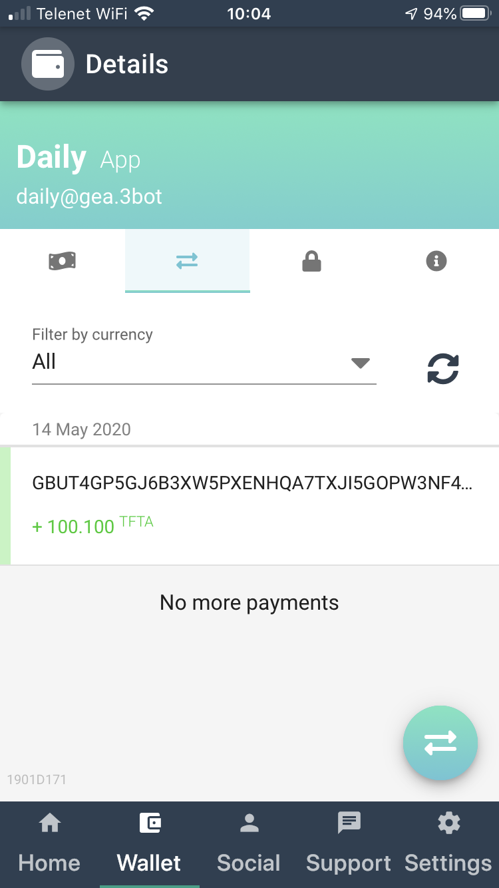
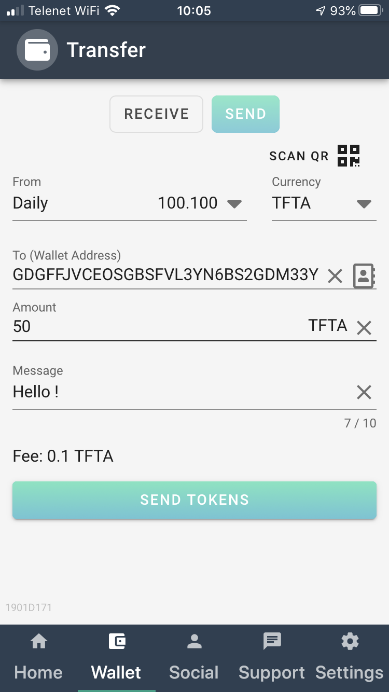
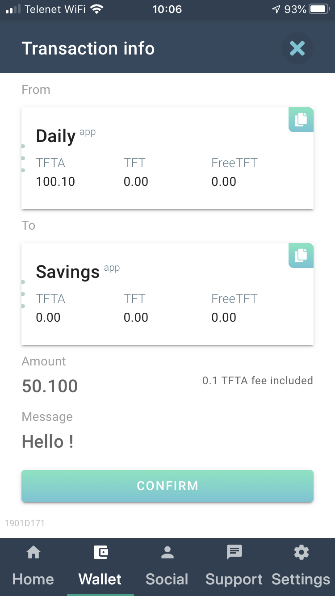
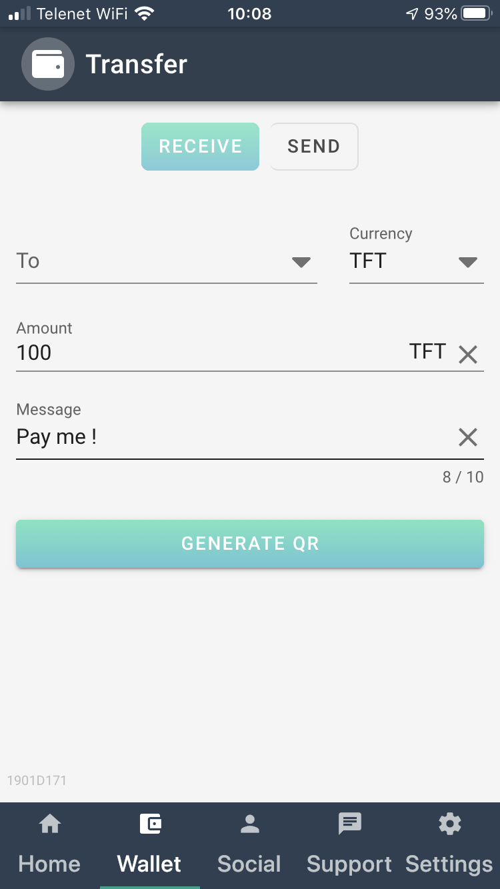
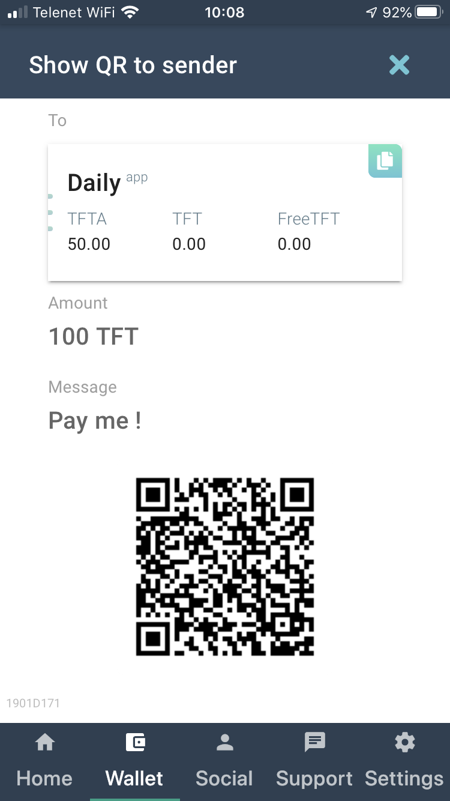

## The wallet in 3Bot Connect app

#### Where 
The 3Bot Connect wallet can be found in the 3Bot connect app (available on Android and iOS), behind the small `Wallet` icon below your screen. 

#### Overview 
The main page gives you an overview of all your accounts, with in there the 3 Threefold tokens that are defined on the Stellar network. 
For each token, in the upper right corner, there is an icon that copies the public account address into the clipboard.  

#### Detailed views
Clicking on one of the accounts gives you a more detailed view of the individual tokens, with both unlocked and (if applicable) locked balance. 

Clicking further shows you the detail of the past transactions. 

#### Send and receive tokens

The blue circles with arrows allows you to send or receive tokens. 

##### Sending tokens 
You can send tokens to others by specifying the public address of the counterparty's account, the amount of tokens, and a message. there is a dropdown list to indicate the token type you want to transfer. 
A fee of 0.1 TFT or TFTA is applicable. 

Push `SEND TOKENS` and confirm at the next screen. 

##### Receiving tokens
For receiving tokens, you can generate a QR code. You prepare this QR by filling in all fields (account, currency, amount, a message). 

Pushing on `GENERATE QR`brings you to the next screen with the QR. 

