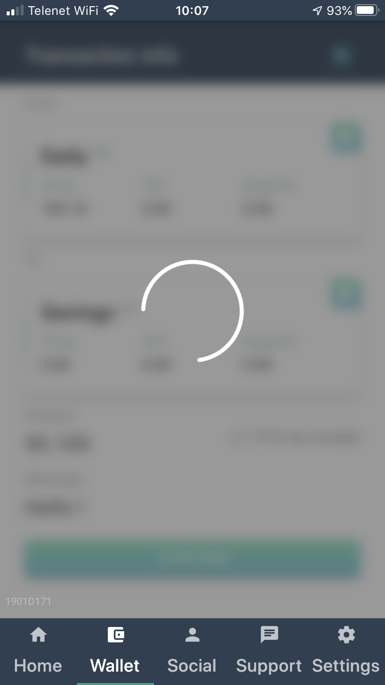
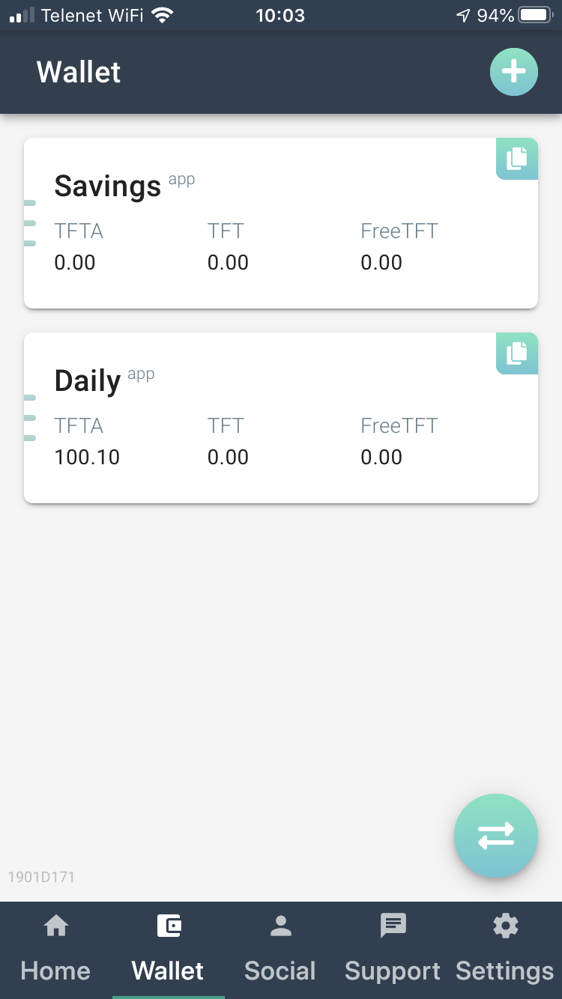

# TFT, FreeTFT and TFTA on Stellar

There are 3 Threefold tokens defined on the Stellar network : 

### TFT
TFT is the default token to be used for capacity reservation on the Threefold grid. Users pay for capacity with TFT. The TFTs are paid out to farmers, and a smaller percentage goes to the Threefold Foundation, the non-profit organisation that promotes the development of the grid. 

### FreeTFT
FreeTFT is free money that can be earned by candidate developers on the Threefold grid, which can be used for exploration of the grid without loosing money on it. 
There are 1000 FreeTFTs that can be requested per 3Bot ID. 
These FreeTFT are not paid out to farmers, but are burned during the reservation process. They are like a coupon and have no long-lasting value. 

### TFTA
TFTA are the TFT tokens that were previously registered on TFchain, the Threefold in-house built blockchain (using Rivine technology). 

#### Convert TFChain TFT to Stellar TFTA using 3Bot Connect App

TFChain TFTs can only be converted into Stellar TFTAs when the keys used to registered these tokens on TFchain are imported into the 3Bot Connect app. 

Once this is done, conversion is simple : after installation of the 3Bot Connect app that has the conversion service inside, entering the wallet using the Wallet tab below the screen is sufficient to start the conversion process. 

During the conversion, you will see the process is ongoing. It is important not to close the app during this conversion process (if there are locked tokens, it can take a while) !

Once the conversion process has ended, you will arrive in the accounts overview page. Done !

